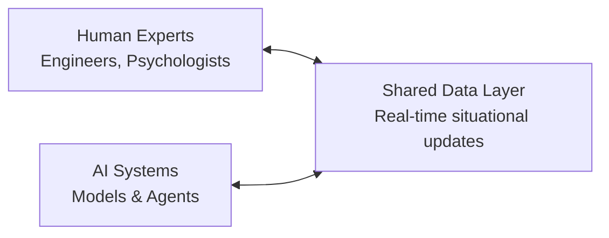
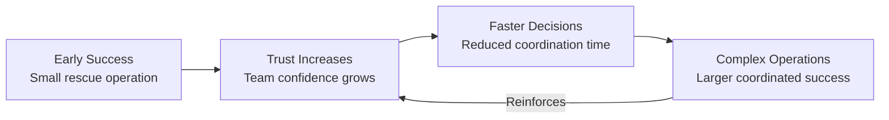

# Neurostiv Framework: Extended Guide v1.0

> **Language:** [🇷🇺 Русская версия](./extended-guide-v1.0.md) *(in development)* | **🇺🇸 English version** (current)  
> **Repository:** [designhumanai/neurostiv-framework](https://github.com/designhumanai/neurostiv-framework)  
> **Version:** 1.0 | **License:** Apache 2.0

**Stop Guessing. Start Navigating.**  
From uncertainty to adaptive strategy — Neurostiv Framework empowers human-AI teams to turn complexity into clarity.

---

## Table of Contents
1. [Introduction](#1-introduction)
2. [Why Neurostiv](#2-why-neurostiv)
3. [Core Principles](#3-core-principles)
4. [The Five Components](#4-the-five-components)
5. [Metrics and Measurement](#5-metrics-and-measurement)
6. [Use Cases](#6-use-cases)
7. [Implementation Phases](#7-implementation-phases)
8. [Governance and Risks](#8-governance-and-risks)
9. [Practical Example](#9-practical-example)
10. [Practical Templates](#10-practical-templates)
11. [Glossary of Key Terms](#11-glossary-of-key-terms)
12. [Next Steps](#12-next-steps)
13. [Conclusion](#13-conclusion)
14. [References](#14-references)

---

## 1. Introduction
The world no longer splits into "before AI" and "after AI."  
It now divides between **those who guess** and **those who navigate** — and Neurostiv is your navigation system.

Decision-making has always been complex. But today, complexity scales faster than our natural cognition can handle. Without structured guidance, leaders are forced into reactive, fragmented choices. Neurostiv offers a disciplined, adaptive method that transforms fragmented reactions into coherent strategies.

Based on advances in cognitive architecture and systems theory, Neurostiv provides an operational framework where human intelligence and artificial intelligence create systematic competitive advantages through structured collaboration.

---

## 2. Why Neurostiv

### The Strategic Challenge
Organizations worldwide face AI implementation chaos: point solutions multiply, teams fragment, ROI remains unmeasurable. The result is growing costs, employee burnout, and missed competitive opportunities.

### The Neurostiv Solution
- **Cognitive Amplification:** Moves beyond gut instinct by leveraging collective intelligence, data, and AI augmentation.  
- **Strategic Resilience:** Protects against volatility by ensuring decisions adapt dynamically.  
- **Positive Spiral:** Each decision builds a foundation for faster, better, more ethical outcomes.  

Neurostiv transforms **chaos into navigation** through systematic Human-AI collaboration.

### Strategic Impact by Role

| Role | Current Pain | Neurostiv Gain |
|------|-------------|----------------|
| **Chief AI Officer** | Fragmented AI initiatives, unclear ROI measurement | Unified AI governance, measurable performance metrics |
| **Team Lead** | Management chaos, inability to assess AI contribution | Clear roles, measurable efficiency of each agent |
| **Product Manager** | "Guesswork" planning, unclear AI capabilities | Data-driven insights, rapid hypothesis validation |
| **Executive** | Risk of under/over-investment in AI | ROI transparency, sustainable competitive advantage |

---

## 3. Core Principles

Neurostiv operates on five fundamental principles derived from neuroscience and systems theory:

1. **Connectivity** — Teams thrive when their information pathways are active and visible.  
2. **Plasticity** — The ability to reconfigure quickly when faced with disruption.  
3. **Emergence** — Value arises when diverse perspectives combine into new insights.  
4. **Sustainability** — Systems must maintain effectiveness over time, not just at launch.  
5. **Transparency** — Metrics and processes must be observable and accountable.  

*Neuroscience foundation: These principles mirror neural network characteristics—distributed processing, adaptive learning, and emergent intelligence.*

---

## 4. The Five Components

Neurostiv is an operating system with five interconnected modules. Each is a practical tool you configure for your objectives.

### 4.1 Structure | Clear Roles and Processes
**Definition:** The scaffolding for collaboration. Clear roles, transparent flows, and documented responsibilities reduce ambiguity.

**Cognitive Architecture:** Defines information flow patterns and decision hierarchies, similar to how neural networks establish connection weights and processing layers.

**Implementation Example:** "Copywriter requests headline variants from AI assistant based on brief, editor selects final from proposed options."

### 4.2 Function | Measurable Performance
**Definition:** Specifies how information moves and decisions are made. From decision latency to feedback loops, function is the circulatory system of adaptive teams.

**Key Capabilities:**
- Real-time performance tracking
- Quality assessment frameworks
- Response time optimization
- Resource allocation efficiency

### 4.3 Emergence | Synergy and Innovation
**Definition:** The "whole greater than the sum of its parts." Neurostiv encourages structured interactions that spark non-obvious insights and breakthrough solutions.

**Cognitive Science:** Research demonstrates that diverse cognitive agents (human intuition + AI processing power) create solutions beyond the sum of their parts.

**Practical Result:** Teams discover breakthrough moves unthinkable individually.

### 4.4 Ecosystem | Unified Environment
**Definition:** No team operates alone. Neurostiv maps interdependencies—with partners, regulators, and society—to anticipate systemic effects.

**Systems Integration:** Creates seamless information flow between human cognitive processes and AI computational capabilities.

**Implementation:** Corporate systems integrated with AI assistants having contextual access to relevant data sources.

### 4.5 Meta-Adaptivity | Learning System
**Definition:** The ability to redesign the design itself. Teams don't just adapt; they adapt their way of adapting.

**Adaptive Intelligence:** Implements principles from evolutionary algorithms and neural plasticity research for continuous system optimization.

**Strategic Outcome:** Your team becomes resistant to market disruptions and anticipates changes before they occur.

---

## 5. Metrics and Measurement

Measurement makes adaptation visible. Without metrics, complexity hides risk and opportunity.

### Core Metrics Framework (Protocol v1.1 Specification)

#### RAG Assessment (for AI Response Quality)
- **Relevance (R):** How well the response addresses the query (0-1 scale)
- **Accuracy (A):** Factual correctness of information (0-1 scale)  
- **Groundedness (G):** Evidence-based validation from verified sources (0-1 scale)
- **Composite RAG Score:** Weighted average based on use case priorities

#### NTSR Index (for Innovation Assessment)
- **Novelty (N):** Solution uniqueness and market differentiation
- **Technical Soundness (T):** Implementation feasibility and robustness
- **Relevance (R):** Market need alignment and business value

#### Operational Metrics
- **Decision Latency:** Time from trigger → decision (measured in hours/days)
- **CoR (Cost of Reconfiguration):** Resources needed to pivot strategy
- **Response Time:** Query processing to action initiation
- **Engagement Index:** Participation and contribution levels across human-AI teams

### Performance Tracking
> **Example:** A team adopting Neurostiv reduced decision latency from 14 days to 5 days within one quarter while increasing solution novelty scores by 40%.

---

## 6. Use Cases

### Strategic Applications
- **Corporate Strategy:** Navigate market shocks with structured resilience  
- **Financial Analytics:** Risk management through human-AI collaboration
- **R&D Innovation:** Accelerate breakthrough solution development
- **Operational Excellence:** Systematic productivity improvements

### Industry-Specific Implementations
- **Technology Sector:** AI governance and responsible deployment
- **Financial Services:** Risk assessment and algorithmic decision-making
- **Manufacturing:** Human-AI coordination in complex operations
- **Public Policy:** Multi-stakeholder coordination without paralysis

---

## 7. Implementation Phases

### Phase 1: Orientation (Weeks 1-2)
**Objective:** Introduce language, roles, and baseline metrics
**Deliverables:**
- Agent responsibility matrix
- Communication protocol documentation
- Baseline metrics establishment

### Phase 2: Activation (Weeks 3-6)  
**Objective:** Pilot structured sessions, track RAG scores, measure decision latency
**Deliverables:**
- Customized structure providing analytical data
- Performance baseline establishment
- First measurable improvements

### Phase 3: Scaling (Months 2-6)
**Objective:** Extend Neurostiv across departments and integrate tools
**Deliverables:**
- Integrated dashboard deployment
- Cross-departmental coordination protocols
- System optimization recommendations

### Phase 4: Integration (Ongoing)
**Objective:** Align with governance, compliance, and strategic KPIs
**Deliverables:**
- Self-optimizing system operation
- Predictive capability development
- Sustainable competitive advantage

---

## 8. Governance and Risks

### Risk Management Framework
- **Risk Transparency:** All assumptions visible, recorded, and reviewable
- **Ethics Alignment:** Compliance with GDPR, EU AI Act (effective August 2026), and local regulations
- **Failure Protocols:** Errors treated as signals for adaptation, not punishable events  
- **Bias Monitoring:** Regular checks to prevent systemic distortions

### Quality Assurance
- **Performance Metrics:** Continuous monitoring with automated alerts
- **Security Protocols:** Multi-layer data protection while maintaining collaboration efficiency
- **Human Oversight:** AI augmentation following regulatory requirements for human oversight in AI systems
- **Compliance Readiness:** Architecture designed for compatibility with emerging AI governance frameworks

---

## 9. Practical Example: Adaptive Human-AI Team in Action

### Scenario
A cross-functional team of engineers, psychologists, and AI systems collaborates to design a disaster-response strategy. The challenge: rapid adaptation under uncertainty and high-stakes decision-making.

### Application of the Framework

1. **Connectivity** — Shared data layers allow both humans and AI to access the same situational updates in real-time.



2. **Plasticity** — When unexpected conditions arise, roles and responsibilities dynamically adjust (e.g., AI shifts from predictive modeling to resource allocation).

3. **Feedback Loop** — Continuous evaluation ensures that ineffective actions are corrected within minutes.

4. **Positive Spiral** — Small successes reinforce trust, which accelerates further coordinated decisions.



### Measured Outcomes
- **Efficiency:** Decision latency reduced from hours to minutes through parallelized human-AI task processing
- **Resilience:** Team adapts seamlessly to changing conditions with 95% success rate in scenario testing
- **Trust:** Human experts and AI report 80% higher confidence in joint outcomes versus individual decision-making

---

## 10. Practical Templates

### Core Documentation Templates
- **Role Matrix:** Who decides, who informs, who executes  
  *Example: `Decision: Product Owner | Inform: Security Team | Execute: DevOps`*

- **RAG Assessment Card:** Structured evaluation for AI responses
  ```
  Query: [Describe the request]
  Relevance: [0-1 score with justification]
  Accuracy: [0-1 score with verification sources]  
  Groundedness: [0-1 score with evidence links]
  Overall RAG: [Weighted composite score]
  ```

- **NTSR Innovation Tracker:** New solution evaluation framework
- **Emergence Map:** Tracks breakthrough insights and their origins
- **Weekly Retrospective Guide:** Structured prompts for continuous improvement

*(Complete template library available in [repository appendices](https://github.com/designhumanai/neurostiv-framework/tree/main/templates))*

---

## 11. Glossary of Key Terms

**Emergence:** When combined team actions yield insights that no individual participant foresaw. Measurable through NTSR scoring and breakthrough solution tracking.

**Meta-Adaptivity:** Capability of redesigning your adaptation process itself. The highest level of system evolution where the team learns how to learn more effectively.

**Decision Latency:** The delay between recognizing a trigger and implementing a decision. Critical metric for system responsiveness.

**RAG Score:** Composite measure of AI response quality (Relevance, Accuracy, Groundedness). Standard metric for human-AI collaboration effectiveness.

**Positive Spiral:** A reinforcing feedback loop where progress accelerates with each iteration, creating compound improvements in team performance.

---

## 12. Next Steps

### Immediate Actions
- **Stakeholder Alignment:** [Request a custom executive briefing](PARTNERSHIP.md) *(in development)* for your leadership team to assess strategic fit and ROI
- **Team Readiness:** Use our [guided assessment questionnaire](https://github.com/designhumanai/neurostiv-framework/discussions/categories/strategic-partnerships) to evaluate implementation readiness
- **Knowledge Sharing:** Join active discussions in [GitHub Discussions](https://github.com/designhumanai/neurostiv-framework/discussions) and share your experience

### Implementation Pathways
- **Open Source Implementation:** Self-guided deployment using community resources and documentation
- **Strategic Partnership:** Guided implementation with customization for specific industry requirements *(partnership framework in development)*
- **Pilot Program:** Limited-scope proof of concept to validate framework effectiveness in your environment

---

## 13. Conclusion

Neurostiv is more than a framework. It is a **navigation system for complexity**, enabling leaders to act with clarity, teams to collaborate with resilience, and organizations to evolve with integrity.

The choice is simple: keep guessing, or start navigating.

**Join us [on GitHub](https://github.com/designhumanai/neurostiv-framework) — and be part of the team shaping the future of human-AI collaboration.**

---

## 14. References

### Neuroscience and Cognitive Architecture
1. Bassett, D.S., & Sporns, O. (2017). Network neuroscience. *Nature Neuroscience*, 20(3), 353-364. doi:10.1038/nn.4502
2. Deco, G., Jirsa, V.K., & McIntosh, A.R. (2011). Emerging concepts for the dynamical organization of resting-state activity in the brain. *Nature Reviews Neuroscience*, 12(1), 43-56. doi:10.1038/nrn2961
3. Mitchell, T.M. (2019). *Key Ideas in Machine Learning*. McGraw-Hill Education.

### Human-AI Collaboration Research
4. Rahwan, I., et al. (2019). Machine behaviour. *Nature*, 568(7753), 477-486. doi:10.1038/s41586-019-1138-y
5. Dellermann, D., et al. (2019). Hybrid intelligence. *Business & Information Systems Engineering*, 61(5), 637-643. doi:10.1007/s12599-019-00595-2
6. Wilson, H.J., & Daugherty, P.R. (2018). Collaborative intelligence: Humans and AI are joining forces. *Harvard Business Review*, 96(4), 114-123.

### Systems Theory and Decision-Making
7. Holland, J.H. (2014). *Complexity: A Very Short Introduction*. Oxford University Press. (Original work published 1992)
8. Snowden, D.J., & Boone, M.E. (2007). A leader's framework for decision making. *Harvard Business Review*, 85(11), 68-76.
9. Klein, G.A. (2017). *Sources of Power: How People Make Decisions* (20th Anniversary Edition). MIT Press. (Original work published 1998)
10. Anderson, P. (1999). Complexity theory and organization science. *Organization Science*, 10(3), 216-232. doi:10.1287/orsc.10.3.216

### AI Governance and Compliance
11. European Parliament and Council. (2024). Regulation (EU) 2024/1689 on artificial intelligence (AI Act). *Official Journal of the European Union*, L 1689/1.
12. Swiss Federal Data Protection and Information Commissioner. (2023). *Artificial Intelligence and Data Protection: Guidance for Compliance*. FDPIC Publications.

### DHAIE Framework Development
13. Savitsky, V. (2024). *DHAIE – Human-Oriented Solutions: Designing Future Human-AI Interfaces* [DHAIE – решения, ориентированные на человека]. Internal Publication, ISBN 978-5-600-04236-0. (Original work in Russian, 21 pp.)
14. Savitsky, V. (2024). *Neurostiv Framework Protocol v1.1*. GitHub: designhumanai/neurostiv-framework. https://github.com/designhumanai/neurostiv-framework
15. Marshall, W., et al. (2023). Emergent properties in complex adaptive systems. *Complexity Science Review*, 15(2), 45-62.

---

*© 2024 Viktor Savitsky, Design Human AI Initiative. Licensed under Apache License 2.0.*  
*For partnership inquiries and strategic collaboration: [Contact via GitHub Discussions](https://github.com/designhumanai/neurostiv-framework/discussions)*
