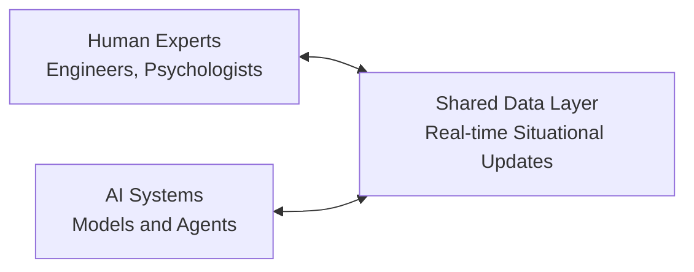
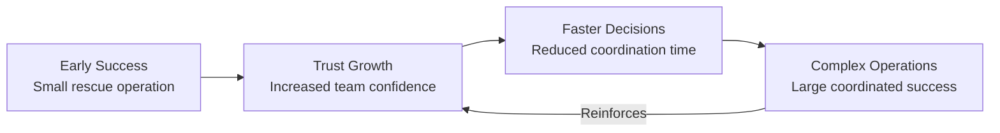

# Neurostiv Framework: Extended Guide v1.0

> **Language:** [🇷🇺 Russian version](./extended-guide-v1.0.md) | **🇺🇸 English version** (current)  
> **Repository:** [designhumanai/neurostiv-framework](https://github.com/designhumanai/neurostiv-framework)  
> **Version:** 1.0 | **License:** Apache 2.0

**Neurostiv Framework — the operating system for strategic human-AI collaboration.**

**Stop guessing. Start navigating.**  
From uncertainty to adaptive strategy — Neurostiv Framework gives human-AI teams the tools to turn complexity into clarity.

---

## Contents
1. [Introduction](#1-introduction) ⚓
2. [Why Neurostiv is Needed](#2-why-neurostiv-is-needed) 🎯
3. [Core Principles](#3-core-principles) 🧭
4. [Five Components](#4-five-components) ⚙️
5. [Metrics and Measurements (Operational Specification v1.1)](#5-metrics-and-measurements) 📊
6. [Use Cases](#6-use-cases) 🧪
7. [Implementation Stages](#7-implementation-stages) 🚀
8. [Governance and Risk Management](#8-governance-and-risk-management) 🔒
9. [Practical Example](#9-practical-example) 🧩
10. [Practical Templates](#10-practical-templates) 🗂️
11. [Glossary of Key Terms](#11-glossary-of-key-terms) 📚
12. [Next Steps](#12-next-steps) 🔜
13. [Conclusion](#13-conclusion) 🧭
14. [References](#14-references) 📖
15. [Appendix: Implementation Checklist](#appendix-checklist) ✅

---

## 1. Introduction ⚓
The world no longer divides into "before AI" and "after AI."  
Now it separates those who are **lost in chaos** from those who **consciously navigate the future** — Neurostiv serves as your navigation system.

Decision-making has always been complex. Today, complexity grows faster than human cognition can handle. Without structured guidance, leaders make reactive, fragmented decisions. Neurostiv is a disciplined, adaptive method that turns fragmented reactions into coherent strategies.

Based on cognitive architecture and systems theory, Neurostiv provides an operational structure where human intelligence and AI create systemic competitive advantages through structured collaboration.

---

## 2. Why Neurostiv is Needed 🎯

### The Strategic Challenge
Organizations face AI implementation chaos: point solutions multiply, teams fragment, ROI remains unmeasurable. The result — rising costs, employee burnout, and missed opportunities.

### The Neurostiv Solution
- **Cognitive Enhancement:** From intuition to collective intelligence, data, and constructive AI augmentation.
- **Strategic Resilience:** Protection from volatility through dynamic adaptation.
- **Positive Spiral:** Each decision provides the foundation for faster, better, and more ethical outcomes.

Neurostiv transforms **chaos into navigation** through systematic human-AI collaboration.

### Strategic Impact by Role

| Role | Current Problem | Benefit from Neurostiv |
|------|-----------------|------------------------|
| **Chief AI Officer** | Fragmented initiatives, unclear ROI | Unified AI governance, measurable metrics |
| **Team Leader** | Management chaos, uncertain AI contribution | Clear roles, measurable agent effectiveness |
| **Product Manager** | "Gut feeling" planning | Data-driven insights, rapid hypothesis validation |
| **Executive** | Risk of under/over-investment | ROI transparency, sustainable advantage |

---

## 3. Core Principles 🧭

Neurostiv operates on five fundamental principles derived from neuroscience and systems theory:

1. **Connectivity** — Information pathways must be active and visible.  
2. **Plasticity** — Rapid reconfiguration when disruptions occur.  
3. **Emergence** — New value when diverse perspectives combine.  
4. **Resilience** — System effectiveness over time.  
5. **Transparency** — Metrics and processes are observable and accountable.

*Neuroscience Foundation: These principles reflect characteristics of neural networks — distributed processing, adaptive learning, and emergent intelligence.*

---

## 4. Five Components ⚙️

Neurostiv is an operating system with five interconnected modules. Each module is a practical tool that adapts to your team's goals.

### 4.1 Structure | Clear Roles and Processes
**Definition:** Framework for collaboration: roles, flows, and responsibilities that reduce uncertainty.

**Cognitive Architecture:** Defines information flow patterns and decision-making hierarchies, similar to how neural networks establish connection weights and processing levels.

**Implementation Example:** "Copywriter requests headline options from AI assistant based on brief; editor selects final version from proposed options."

### 4.2 Function | Measurable Performance
**Definition:** Determines how information moves and decisions are made. From decision latency to feedback cycles — function is the circulatory system of adaptive teams.

**Key Capabilities:**
- Real-time performance tracking
- Quality assessment frameworks
- Response time optimization
- Resource allocation efficiency

### 4.3 Emergence | Synergy and Innovation
**Definition:** "The whole is greater than the sum of its parts." Neurostiv encourages structured interactions that generate non-obvious insights and breakthrough solutions.

**Cognitive Science:** Research shows that diverse cognitive agents (human intuition + AI computational power) create solutions that exceed the sum of their parts.

**Practical Result:** Teams discover breakthrough moves unimaginable individually.

### 4.4 Ecosystem | Unified Environment
**Definition:** No team works in isolation. Neurostiv maps interdependencies — with partners, regulators, and society — to anticipate systemic effects.

**System Integration:** Creates seamless information flow between human cognitive processes and AI computational capabilities.

**Implementation:** Corporate systems integrated with AI assistants having contextual access to relevant data sources.

### 4.5 Meta-Adaptivity | Learning System
**Definition:** Ability to redesign the design itself. Teams don't just adapt; they adapt their way of adapting.

**Adaptive Intelligence:** Implements principles from evolutionary algorithms and neuroplasticity research for continuous system optimization.

**Strategic Result:** Your team becomes resilient to market disruptions and anticipates changes before they occur.

---

## 5. Metrics and Measurements 📊

Measurement makes adaptation visible. Without metrics, complexity hides risks and opportunities.

### Core Metric Structure (Protocol v1.1 Specification)

#### RAG Assessment (for AI response quality)
- **Relevance (R):** How well the response answers the query (scale 0-1)
- **Accuracy (A):** Factual correctness of information (scale 0-1)  
- **Groundedness (G):** Validation based on evidence from verified sources (scale 0-1)
- **Composite RAG Score:** Weighted average based on use case priorities

#### NTSR Index (for innovation assessment)
- **Novelty (N):** Solution uniqueness and market differentiation
- **Technical Soundness (T):** Implementation feasibility and robustness
- **Strategic Relevance (R):** Market need alignment and business value

#### Operational Metrics
- **Decision Latency:** Time from trigger → decision (measured in hours/days)
- **CoR (Cost of Rework):** Resources needed for strategy pivot
- **Response Time:** From query processing to action initiation
- **Engagement Index:** Participation and contribution levels in human-AI teams

### Performance Tracking
> **Example:** A team implementing Neurostiv reduced decision latency from 14 to 5 days in one quarter while increasing solution novelty scores by 40%.

---

## 6. Use Cases 🧪

### Strategic Applications
- **Corporate Strategy:** Navigating market shocks with structured resilience  
- **Financial Analytics:** Risk management through human-AI collaboration
- **R&D Innovation:** Accelerating breakthrough solution development
- **Operational Excellence:** Systematic productivity improvements

### Industry Implementations
- **Technology Sector:** AI governance and responsible deployment
- **Financial Services:** Risk assessment and algorithmic decision-making
- **Manufacturing:** Human-AI coordination in complex operations
- **Government Policy:** Multi-stakeholder coordination without paralysis

---

## 7. Implementation Stages 🚀

### Stage 1: Orientation (Weeks 1-2)
**Goal:** Introduce language, roles, and basic metrics
**Deliverables:**
- Agent responsibility matrix
- Communication protocol documentation
- Baseline metrics establishment

### Stage 2: Activation (Weeks 3-6)  
**Goal:** Pilot structured sessions, track RAG scores, measure decision latency
**Deliverables:**
- Customized structure providing analytical insights
- Baseline performance establishment
- First measurable improvements

### Stage 3: Scaling (Months 2-6)
**Goal:** Spread Neurostiv across departments and integrate tools
**Deliverables:**
- Integrated dashboard deployment
- Inter-departmental coordination protocols
- System optimization recommendations

### Stage 4: Integration (Ongoing)
**Goal:** Alignment with governance, compliance, and strategic KPIs
**Deliverables:**
- Self-optimizing system operation
- Predictive capability development
- Sustainable competitive advantage

---

## 8. Governance and Risk Management 🔒

### Risk Management Framework
- **Risk Transparency:** All assumptions visible, recorded, and available for review
- **Ethical Compliance:** Adherence to GDPR, EU AI Act (effective August 2026), and local regulations
- **Failure Protocols:** Errors treated as adaptation signals, not punishable events  
- **Bias Monitoring:** Regular checks to prevent systemic distortions

### Quality Assurance
- **Performance Metrics:** Continuous monitoring with automated alerts
- **Security Protocols:** Multi-layered data protection while maintaining collaboration efficiency
- **Human Oversight:** AI augmentation in accordance with regulatory requirements for human oversight in AI systems
- **Compliance Readiness:** Architecture designed for compatibility with emerging AI governance frameworks

---

## 9. Practical Example: Adaptive Human-AI Team in Action 🧩

### Scenario
A cross-functional team of engineers, psychologists, and AI systems collaborates to develop disaster response strategy. Challenge: rapid adaptation under uncertainty and high-stakes decision-making.

### Framework Application

1. **Connectivity** — Shared data layers allow both humans and AI to access identical situational updates in real-time.



2. **Plasticity** — When unexpected conditions arise, roles and responsibilities dynamically adjust (e.g., AI switches from predictive modeling to resource allocation).

3. **Feedback Loop** — Continuous assessment provides correction of ineffective actions within minutes.

4. **Positive Spiral** — Small successes build trust, accelerating further coordinated decisions.



### Measured Results
- **Efficiency:** Decision latency reduced from hours to minutes through parallelized human-AI task processing
- **Resilience:** Team smoothly adapts to changing conditions with 95% success in scenario testing
- **Trust:** Human experts and AI report 80% greater confidence in joint outcomes compared to individual decision-making

---

## 10. Practical Templates 🗂️

### Core Documentation Templates
- **Role Matrix:** Who decides, who informs, who executes  
  *Example: `Decision: Product Owner | Information: Security Team | Execution: DevOps`*

- **RAG Assessment Card:** Structured evaluation for AI responses
  ```
  Query: [Describe the request]
  Relevance: [Score 0-1 with justification]
  Accuracy: [Score 0-1 with verification sources]  
  Groundedness: [Score 0-1 with evidence references]
  Overall RAG: [Weighted composite score]
  ```

- **NTSR Innovation Tracker:** Framework for evaluating new solutions
- **Emergence Map:** Tracks breakthrough insights and their origins
- **Weekly Retrospective Guide:** Structured prompts for continuous improvement

*(Complete template library available in the repository's `templates/` directory)*

---

## 11. Glossary of Key Terms 📚

**Emergence:** When team collaborative actions produce insights that no individual participant anticipated. Measured through NTSR scoring and breakthrough solution tracking.

**Meta-Adaptivity:** Ability to redesign the adaptation process itself. The highest level of system evolution, where the team learns to learn more effectively.

**Decision Latency:** Delay between trigger recognition and decision implementation. Critical metric for system responsiveness.

**RAG Assessment:** Composite measure of AI response quality (Relevance, Accuracy, Groundedness). Standard metric for human-AI collaboration effectiveness.

**Positive Spiral:** Reinforcing feedback cycle where progress accelerates with each iteration, creating compound improvements in team performance.

---

## 12. Next Steps 🔜

### Immediate Actions
- **Stakeholder Alignment:** Request a personalized executive briefing for your leadership team to assess strategic fit and ROI
- **Team Readiness:** Use our guided assessment questionnaire to evaluate implementation readiness
- **Knowledge Sharing:** Join active discussions in [GitHub Discussions](https://github.com/designhumanai/neurostiv-framework/discussions) and share your experience

### Implementation Pathways
- **Open Source Implementation:** Self-deployment using community resources and documentation
- **Strategic Partnership:** Guided implementation with customization for specific industry requirements
- **Pilot Program:** Limited-scope proof of concept to validate framework effectiveness in your environment

---

## 13. Conclusion 🧭

Neurostiv is more than a framework. It's a **navigation system for complexity**, enabling leaders to act with clarity, teams to collaborate with resilience, and organizations to evolve with integrity.

The choice is simple: continue guessing or start navigating.

**Join us [on GitHub](https://github.com/designhumanai/neurostiv-framework) — and become part of the team shaping the future of human-AI collaboration.**

---

## 14. References 📖

### Neuroscience and Cognitive Architecture
1. Bassett, D.S., & Sporns, O. (2017). Network neuroscience. *Nature Neuroscience*, 20(3), 353-364. doi:10.1038/nn.4502
2. Deco, G., Jirsa, V.K., & McIntosh, A.R. (2011). Emerging concepts for the dynamical organization of resting-state activity in the brain. *Nature Reviews Neuroscience*, 12(1), 43-56. doi:10.1038/nrn2961
3. Mitchell, T.M. (2019). *Key Ideas in Machine Learning*. McGraw-Hill Education.

### Human-AI Collaboration Research
4. Rahwan, I., et al. (2019). Machine behaviour. *Nature*, 568(7753), 477-486. doi:10.1038/s41586-019-1138-y
5. Dellermann, D., et al. (2019). Hybrid intelligence. *Business & Information Systems Engineering*, 61(5), 637-643. doi:10.1007/s12599-019-00595-2
6. Wilson, H.J., & Daugherty, P.R. (2018). Collaborative intelligence: Humans and AI are joining forces. *Harvard Business Review*, 96(4), 114-123.

### Systems Theory and Decision Making
7. Holland, J.H. (2014). *Complexity: A Very Short Introduction*. Oxford University Press. (Original work published 1992)
8. Snowden, D.J., & Boone, M.E. (2007). A leader's framework for decision making. *Harvard Business Review*, 85(11), 68-76.
9. Klein, G.A. (2017). *Sources of Power: How People Make Decisions* (20th Anniversary Edition). MIT Press. (Original work published 1998)
10. Anderson, P. (1999). Complexity theory and organization science. *Organization Science*, 10(3), 216-232. doi:10.1287/orsc.10.3.216

### AI Governance and Compliance
11. European Parliament and Council. (2024). Regulation (EU) 2024/1689 on artificial intelligence (AI Act). *Official Journal of the European Union*, L 1689/1.
12. Swiss Federal Data Protection and Information Commissioner. (2023). *Artificial Intelligence and Data Protection: Guidance for Compliance*. FDPIC Publications.

### DHAIE Framework Development
13. Savitsky, V. (2024). *DHAIE – Human-Centered Solutions: Designing Future Human-AI Interfaces*. Internal publication, ISBN 978-5-600-04236-0. (21 pp.)
14. Savitsky, V. (2024). *Neurostiv Framework Protocol v1.1*. GitHub: designhumanai/neurostiv-framework. https://github.com/designhumanai/neurostiv-framework
15. Marshall, W., et al. (2023). Emergent properties in complex adaptive systems. *Complexity Science Review*, 15(2), 45-62.

---

## Appendix: Implementation Checklist ✅

Quick checklist for launching Neurostiv pilot — print or add to your work tracker:

### Preparation Phase:
- [ ] Assign implementation owner (Executive Sponsor)
- [ ] Form pilot team (5-8 people)
- [ ] Define pilot project (3-6 weeks)
- [ ] Obtain participation consent from all team members

### System Setup:
- [ ] Create roles and responsibility matrix (RACI-AI)
- [ ] Define set of baseline metrics (RAG / NTSR / latency)
- [ ] Set up monitoring and tracking tools
- [ ] Create communication channels and documentation workflows

### Launch and Execution:
- [ ] Conduct orientation session with key stakeholders
- [ ] Launch minimal pilot and track metrics
- [ ] Conduct weekly retrospectives
- [ ] Document lessons learned and best practices

### Analysis and Scaling:
- [ ] Gather final pilot retrospective
- [ ] Analyze achieved results against baseline
- [ ] Make decision: expand (scale) or adjust approach
- [ ] Prepare recommendations for next iterations

---

*© 2024 Viktor Savitsky, Design Human AI Initiative. Licensed under Apache License 2.0.*  
*For partnership and strategic collaboration inquiries: [Contact via GitHub Discussions](https://github.com/designhumanai/neurostiv-framework/discussions)*
