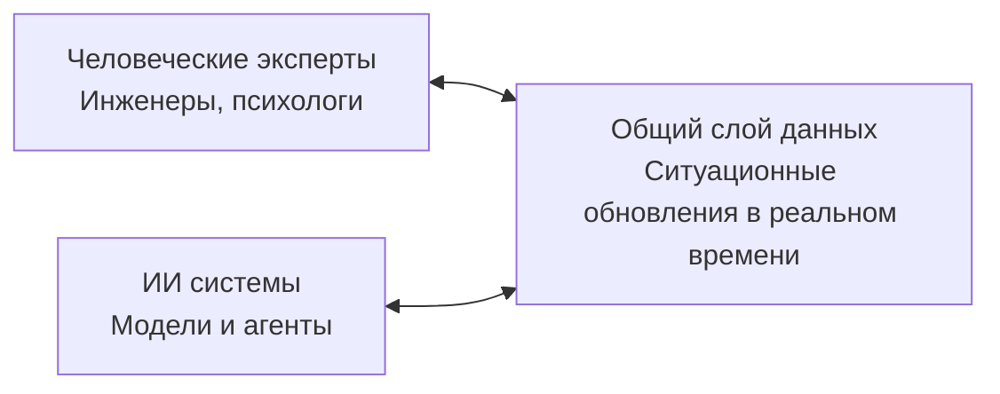
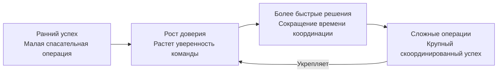

# Neurostiv Framework: Расширенное руководство v1.0

> **Язык:** **🇷🇺 Русская версия** (текущая) | [🇺🇸 English version](./extended-guide-v1.0.en.md)  
> **Репозиторий:** [designhumanai/neurostiv-framework](https://github.com/designhumanai/neurostiv-framework)  
> **Версия:** 1.0 | **Лицензия:** Apache 2.0

**Хватит гадать. Начните навигацию.**  
От неопределенности к адаптивной стратегии — Neurostiv Framework дает командам человек-ИИ возможность превращать сложность в ясность.

---

## Содержание
1. [Введение](#1-введение)
2. [Зачем нужен Neurostiv](#2-зачем-нужен-neurostiv)
3. [Основные принципы](#3-основные-принципы)
4. [Пять компонентов](#4-пять-компонентов)
5. [Метрики и измерения](#5-метрики-и-измерения)
6. [Сценарии использования](#6-сценарии-использования)
7. [Этапы внедрения](#7-этапы-внедрения)
8. [Управление и риски](#8-управление-и-риски)
9. [Практический пример](#9-практический-пример)
10. [Практические шаблоны](#10-практические-шаблоны)
11. [Глоссарий ключевых терминов](#11-глоссарий-ключевых-терминов)
12. [Следующие шаги](#12-следующие-шаги)
13. [Заключение](#13-заключение)
14. [Литература](#14-литература)

---

## 1. Введение
Мир больше не делится на «до ИИ» и «после ИИ».  
Теперь он разделяется между **теми, кто гадает** и **теми, кто навигирует** — а Neurostiv — это ваша навигационная система.

Принятие решений всегда было сложным. Но сегодня сложность растет быстрее, чем может справиться наше естественное познание. Без структурированного руководства лидеры вынуждены принимать реактивные, фрагментированные решения. Neurostiv предлагает дисциплинированный, адаптивный метод, который превращает фрагментированные реакции в связные стратегии.

Основанный на достижениях когнитивной архитектуры и системной теории, Neurostiv предоставляет операционную структуру, где человеческий интеллект и искусственный интеллект создают систематические конкурентные преимущества через структурированное сотрудничество.

---

## 2. Зачем нужен Neurostiv

### Стратегический вызов
Организации по всему миру сталкиваются с хаосом внедрения ИИ: точечные решения множатся, команды фрагментируются, ROI остается неизмеримым. Результат — растущие расходы, выгорание сотрудников и упущенные конкурентные возможности.

### Решение Neurostiv
- **Когнитивное усиление:** Выходит за рамки интуитивных решений, используя коллективный интеллект, данные и усиление ИИ.  
- **Стратегическая устойчивость:** Защищает от волатильности, обеспечивая динамическую адаптацию решений.  
- **Позитивная спираль:** Каждое решение создает основу для более быстрых, лучших и этичных результатов.  

Neurostiv превращает **хаос в навигацию** через систематическое сотрудничество человека и ИИ.

### Стратегическое воздействие по ролям

| Роль | Текущая проблема | Выгода от Neurostiv |
|------|------------------|---------------------|
| **Директор по ИИ** | Фрагментированные ИИ-инициативы, неясное измерение ROI | Единое управление ИИ, измеримые показатели производительности |
| **Руководитель команды** | Управленческий хаос, невозможность оценить вклад ИИ | Четкие роли, измеримая эффективность каждого агента |
| **Продакт-менеджер** | Планирование «на глазок», неясные возможности ИИ | Инсайты на основе данных, быстрая валидация гипотез |
| **Руководитель** | Риск недо/перинвестирования в ИИ | Прозрачность ROI, устойчивое конкурентное преимущество |

---

## 3. Основные принципы

Neurostiv работает на основе пяти фундаментальных принципов, выведенных из нейронауки и системной теории:

1. **Связность** — Команды процветают, когда их информационные пути активны и видимы.  
2. **Пластичность** — Способность быстро перестраиваться при столкновении с нарушениями.  
3. **Эмерджентность** — Ценность возникает, когда разнообразные перспективы объединяются в новые инсайты.  
4. **Устойчивость** — Системы должны сохранять эффективность во времени, а не только в момент запуска.  
5. **Прозрачность** — Метрики и процессы должны быть наблюдаемыми и подотчетными.  

*Нейронаучная основа: Эти принципы отражают характеристики нейронных сетей — распределенную обработку, адаптивное обучение и эмерджентный интеллект.*

---

## 4. Пять компонентов

Neurostiv — это операционная система с пятью взаимосвязанными модулями. Каждый является практическим инструментом, который вы настраиваете под свои цели.

### 4.1 Структура | Четкие роли и процессы
**Определение:** Каркас для сотрудничества. Четкие роли, прозрачные потоки и документированные обязанности снижают неопределенность.

**Когнитивная архитектура:** Определяет паттерны информационного потока и иерархии принятия решений, аналогично тому, как нейронные сети устанавливают веса связей и уровни обработки.

**Пример внедрения:** «Копирайтер запрашивает варианты заголовков у ИИ-ассистента на основе брифа, редактор выбирает финальный из предложенных вариантов.»

### 4.2 Функция | Измеримая производительность
**Определение:** Определяет, как движется информация и принимаются решения. От латентности решений до циклов обратной связи — функция является кровеносной системой адаптивных команд.

**Ключевые возможности:**
- Отслеживание производительности в реальном времени
- Фреймворки оценки качества
- Оптимизация времени отклика
- Эффективность распределения ресурсов

### 4.3 Эмерджентность | Синергия и инновации
**Определение:** «Целое больше суммы частей». Neurostiv поощряет структурированные взаимодействия, которые порождают неочевидные инсайты и прорывные решения.

**Когнитивная наука:** Исследования показывают, что разнообразные когнитивные агенты (человеческая интуиция + вычислительная мощь ИИ) создают решения, превосходящие сумму их частей.

**Практический результат:** Команды обнаруживают прорывные ходы, немыслимые индивидуально.

### 4.4 Экосистема | Единая среда
**Определение:** Ни одна команда не работает в изоляции. Neurostiv картирует взаимозависимости — с партнерами, регуляторами и обществом — для предвидения системных эффектов.

**Системная интеграция:** Создает бесшовный информационный поток между человеческими когнитивными процессами и вычислительными возможностями ИИ.

**Внедрение:** Корпоративные системы, интегрированные с ИИ-ассистентами, имеющими контекстуальный доступ к релевантным источникам данных.

### 4.5 Мета-адаптивность | Обучающаяся система
**Определение:** Способность переделывать сам дизайн. Команды не просто адаптируются; они адаптируют свой способ адаптации.

**Адаптивный интеллект:** Реализует принципы из эволюционных алгоритмов и исследований нейропластичности для непрерывной оптимизации системы.

**Стратегический результат:** Ваша команда становится устойчивой к рыночным нарушениям и предвидит изменения до их наступления.

---

## 5. Метрики и измерения

Измерение делает адаптацию видимой. Без метрик сложность скрывает риски и возможности.

### Основная метрическая структура (Спецификация Протокола v1.1)

#### RAG Оценка (для качества ответов ИИ)
- **Релевантность (R):** Насколько хорошо ответ отвечает на запрос (шкала 0-1)
- **Точность (A):** Фактическая корректность информации (шкала 0-1)  
- **Обоснованность (G):** Валидация на основе доказательств из верифицированных источников (шкала 0-1)
- **Композитная RAG Оценка:** Взвешенное среднее на основе приоритетов случая использования

#### NTSR Индекс (для оценки инноваций)
- **Новизна (N):** Уникальность решения и рыночная дифференциация
- **Техническая надежность (T):** Осуществимость внедрения и робастность
- **Релевантность (R):** Соответствие рыночной потребности и бизнес-ценность

#### Операционные метрики
- **Латентность решения:** Время от триггера → решение (измеряется в часах/днях)
- **CoR (Стоимость перестройки):** Ресурсы, необходимые для поворота стратегии
- **Время отклика:** От обработки запроса до инициации действия
- **Индекс вовлеченности:** Уровни участия и вклада в командах человек-ИИ

### Отслеживание производительности
> **Пример:** Команда, внедрившая Neurostiv, сократила латентность решений с 14 до 5 дней за один квартал, увеличив при этом оценки новизны решений на 40%.

---

## 6. Сценарии использования

### Стратегические применения
- **Корпоративная стратегия:** Навигация рыночных шоков со структурированной устойчивостью  
- **Финансовая аналитика:** Риск-менеджмент через сотрудничество человека и ИИ
- **НИОКР инновации:** Ускорение разработки прорывных решений
- **Операционное совершенство:** Систематические улучшения продуктивности

### Отраслевые внедрения
- **Технологический сектор:** Управление ИИ и ответственное развертывание
- **Финансовые услуги:** Оценка рисков и алгоритмическое принятие решений
- **Производство:** Координация человека и ИИ в сложных операциях
- **Государственная политика:** Координация множественных заинтересованных сторон без паралича

---

## 7. Этапы внедрения

### Этап 1: Ориентация (Недели 1-2)
**Цель:** Внедрить язык, роли и базовые метрики
**Результаты:**
- Матрица ответственности агентов
- Документация протокола коммуникации
- Установление базовых метрик

### Этап 2: Активация (Недели 3-6)  
**Цель:** Пилотные структурированные сессии, отслеживание RAG оценок, измерение латентности решений
**Результаты:**
- Кастомизированная структура, предоставляющая аналитические данные
- Установление базовой производительности
- Первые измеримые улучшения

### Этап 3: Масштабирование (Месяцы 2-6)
**Цель:** Распространение Neurostiv по департаментам и интеграция инструментов
**Результаты:**
- Развертывание интегрированного дашборда
- Протоколы межведомственной координации
- Рекомендации по оптимизации системы

### Этап 4: Интеграция (Постоянно)
**Цель:** Выравнивание с управлением, соблюдением требований и стратегическими KPI
**Результаты:**
- Самооптимизирующаяся работа системы
- Развитие прогностических способностей
- Устойчивое конкурентное преимущество

---

## 8. Управление и риски

### Фреймворк управления рисками
- **Прозрачность рисков:** Все предположения видимы, записаны и доступны для пересмотра
- **Этическое соответствие:** Соблюдение GDPR, EU AI Act (действует с августа 2026) и местных регуляций
- **Протоколы сбоев:** Ошибки рассматриваются как сигналы для адаптации, а не наказуемые события  
- **Мониторинг предвзятости:** Регулярные проверки для предотвращения системных искажений

### Обеспечение качества
- **Метрики производительности:** Непрерывный мониторинг с автоматическими уведомлениями
- **Протоколы безопасности:** Многоуровневая защита данных при сохранении эффективности сотрудничества
- **Человеческий надзор:** Усиление ИИ в соответствии с регулятивными требованиями человеческого надзора в ИИ-системах
- **Готовность к соблюдению:** Архитектура, разработанная для совместимости с новыми фреймворками управления ИИ

---

## 9. Практический пример: Адаптивная команда человек-ИИ в действии

### Сценарий
Кросс-функциональная команда инженеров, психологов и ИИ-систем сотрудничает для разработки стратегии реагирования на бедствия. Вызов: быстрая адаптация в условиях неопределенности и принятия решений с высокими ставками.

### Применение фреймворка

1. **Связность** — Общие слои данных позволяют и людям, и ИИ получать доступ к одинаковым ситуационным обновлениям в реальном времени.



2. **Пластичность** — При возникновении неожиданных условий роли и обязанности динамически корректируются (например, ИИ переключается с прогностического моделирования на распределение ресурсов).

3. **Цикл обратной связи** — Непрерывная оценка обеспечивает коррекцию неэффективных действий в течение минут.

4. **Позитивная спираль** — Небольшие успехи укрепляют доверие, что ускоряет дальнейшие скоординированные решения.



### Измеренные результаты
- **Эффективность:** Латентность решений сокращена с часов до минут благодаря параллелизованной обработке задач человек-ИИ
- **Устойчивость:** Команда плавно адаптируется к изменяющимся условиям с 95% успешностью в сценарном тестировании
- **Доверие:** Человеческие эксперты и ИИ сообщают о 80% большей уверенности в совместных результатах по сравнению с индивидуальным принятием решений

---

## 10. Практические шаблоны

### Основные шаблоны документации
- **Матрица ролей:** Кто решает, кто информирует, кто исполняет  
  *Пример: `Решение: Владелец продукта | Информирование: Команда безопасности | Исполнение: DevOps`*

- **Карта RAG оценки:** Структурированная оценка для ответов ИИ
  ```
  Запрос: [Опишите запрос]
  Релевантность: [Оценка 0-1 с обоснованием]
  Точность: [Оценка 0-1 с источниками верификации]  
  Обоснованность: [Оценка 0-1 со ссылками на доказательства]
  Общий RAG: [Взвешенная композитная оценка]
  ```

- **NTSR Трекер инноваций:** Фреймворк оценки новых решений
- **Карта эмерджентности:** Отслеживает прорывные инсайты и их происхождение
- **Руководство еженедельной ретроспективы:** Структурированные промпты для непрерывного улучшения

*(Полная библиотека шаблонов доступна в [приложениях репозитория](https://github.com/designhumanai/neurostiv-framework/tree/main/templates))*

---

## 11. Глоссарий ключевых терминов

**Эмерджентность:** Когда совместные действия команды дают инсайты, которые не предвидел ни один отдельный участник. Измеряется через NTSR скоринг и отслеживание прорывных решений.

**Мета-адаптивность:** Способность переделывать сам процесс адаптации. Высший уровень эволюции системы, где команда учится учиться более эффективно.

**Латентность решения:** Задержка между распознаванием триггера и реализацией решения. Критическая метрика для отзывчивости системы.

**RAG Оценка:** Композитная мера качества ответа ИИ (Релевантность, Точность, Обоснованность). Стандартная метрика для эффективности сотрудничества человека и ИИ.

**Позитивная спираль:** Усиливающийся цикл обратной связи, где прогресс ускоряется с каждой итерацией, создавая составные улучшения в производительности команды.

---

## 12. Следующие шаги

### Немедленные действия
- **Согласование заинтересованных сторон:** [Запросите персонализированный исполнительный брифинг](PARTNERSHIP.md) *(в разработке)* для вашей команды руководителей для оценки стратегического соответствия и ROI
- **Готовность команды:** Используйте наш [направляемый опросник оценки](https://github.com/designhumanai/neurostiv-framework/discussions/categories/strategic-partnerships) для оценки готовности к внедрению
- **Обмен знаниями:** Присоединяйтесь к активным обсуждениям в [GitHub Discussions](https://github.com/designhumanai/neurostiv-framework/discussions) и делитесь своим опытом

### Пути внедрения
- **Open Source внедрение:** Самостоятельное развертывание с использованием ресурсов сообщества и документации
- **Стратегическое партнерство:** Управляемое внедрение с кастомизацией под специфические отраслевые требования *(фреймворк партнерства в разработке)*
- **Пилотная программа:** Ограниченное по масштабу подтверждение концепции для валидации эффективности фреймворка в вашей среде

---

## 13. Заключение

Neurostiv — это больше чем фреймворк. Это **навигационная система для сложности**, позволяющая лидерам действовать с ясностью, командам сотрудничать с устойчивостью, а организациям развиваться с целостностью.

Выбор прост: продолжать гадать или начать навигацию.

**Присоединяйтесь к нам [на GitHub](https://github.com/designhumanai/neurostiv-framework) — и станьте частью команды, формирующей будущее сотрудничества человека и ИИ.**

---

## 14. Литература

### Нейронаука и когнитивная архитектура
1. Bassett, D.S., & Sporns, O. (2017). Network neuroscience. *Nature Neuroscience*, 20(3), 353-364. doi:10.1038/nn.4502
2. Deco, G., Jirsa, V.K., & McIntosh, A.R. (2011). Emerging concepts for the dynamical organization of resting-state activity in the brain. *Nature Reviews Neuroscience*, 12(1), 43-56. doi:10.1038/nrn2961
3. Mitchell, T.M. (2019). *Key Ideas in Machine Learning*. McGraw-Hill Education.

### Исследования сотрудничества человека и ИИ
4. Rahwan, I., et al. (2019). Machine behaviour. *Nature*, 568(7753), 477-486. doi:10.1038/s41586-019-1138-y
5. Dellermann, D., et al. (2019). Hybrid intelligence. *Business & Information Systems Engineering*, 61(5), 637-643. doi:10.1007/s12599-019-00595-2
6. Wilson, H.J., & Daugherty, P.R. (2018). Collaborative intelligence: Humans and AI are joining forces. *Harvard Business Review*, 96(4), 114-123.

### Системная теория и принятие решений
7. Holland, J.H. (2014). *Complexity: A Very Short Introduction*. Oxford University Press. (Оригинальная работа опубликована в 1992)
8. Snowden, D.J., & Boone, M.E. (2007). A leader's framework for decision making. *Harvard Business Review*, 85(11), 68-76.
9. Klein, G.A. (2017). *Sources of Power: How People Make Decisions* (20th Anniversary Edition). MIT Press. (Оригинальная работа опубликована в 1998)
10. Anderson, P. (1999). Complexity theory and organization science. *Organization Science*, 10(3), 216-232. doi:10.1287/orsc.10.3.216

### Управление ИИ и соблюдение требований
11. European Parliament and Council. (2024). Regulation (EU) 2024/1689 on artificial intelligence (AI Act). *Official Journal of the European Union*, L 1689/1.
12. Swiss Federal Data Protection and Information Commissioner. (2023). *Artificial Intelligence and Data Protection: Guidance for Compliance*. FDPIC Publications.

### Разработка DHAIE Framework
13. Савицкий, В. (2024). *DHAIE – решения, ориентированные на человека: Проектирование будущих интерфейсов человек-ИИ*. Внутренняя публикация, ISBN 978-5-600-04236-0. (21 стр.)
14. Savitsky, V. (2024). *Neurostiv Framework Protocol v1.1*. GitHub: designhumanai/neurostiv-framework. https://github.com/designhumanai/neurostiv-framework
15. Marshall, W., et al. (2023). Emergent properties in complex adaptive systems. *Complexity Science Review*, 15(2), 45-62.

---

*© 2024 Виктор Савицкий, Design Human AI Initiative. Лицензировано под Apache License 2.0.*  
*По вопросам партнерства и стратегического сотрудничества: [Связаться через GitHub Discussions](https://github.com/designhumanai/neurostiv-framework/discussions)*
