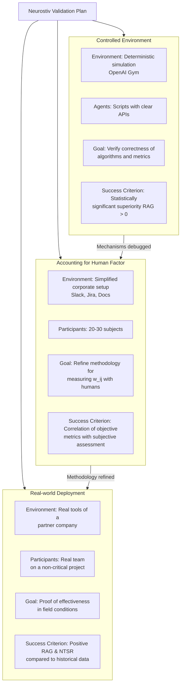

# Neurostiv Framework: Brain Principles as an Engineering Protocol for Adaptive Human-AI Teams (v1.1)

[](docs/protocol-v1.1.md)

## Abstract

**Problem:** Existing human-machine interaction architectures demonstrate low adaptability to uncertainty and novel tasks, creating a cognitive "bottleneck" when integrating AI into teamwork.

**Hypothesis:** Transferring principles of neural organization (redundant connectivity and functional plasticity) to the architecture of Human-AI systems will enhance their adaptability and fault tolerance.

**Method:** A formal mathematical model of dynamic connections between agents and a network activation algorithm has been developed. A three-stage validation plan is proposed, ranging from synthetic experiments to industrial pilots.

**Expected Outcome:** Creation of an open, reproducible protocol for designing adaptive teams with measurable advantages (e.g., gain in novel task resolution speed RAG > 0 and fault tolerance RM ≈ 1.0).

---

## License

This document is distributed under the [CC BY-NC-ND 4.0](https://creativecommons.org/licenses/by-nc-nd/4.0/) license.

You are free to:
- Copy and redistribute the material in any medium or format, provided attribution is given.

You may not:
- Modify the material.
- Use the material for commercial purposes.

---

Full license terms: https://creativecommons.org/licenses/by-nc-nd/4.0/

---

## Address to Management Teams

If you are a development team lead, product manager, or CTO, this article offers you not just a new tool, but a **fundamentally different way of thinking about work organization** in the age of AI.

The problem is familiar: the implementation of AI assistants often fails to deliver the expected breakthrough in efficiency. Teams still get "stuck" on new tasks, any change in requirements triggers a cascade of rework, and the collective intelligence of humans and machines remains underutilized.

The Neurostiv Framework proposes a systemic solution. **This is not a Slack assistant—it is an architectural approach** based on the principles of the most adaptive system in the Universe—the human brain. This is not a theory but a **protocol ready for testing**, with clear metrics and an implementation plan.

---

## Preface

Imagine your team is a neural network. Currently, most organizations operate like old multilayer perceptrons: a request trickles down from the top through rigid, predefined connections. One faulty neuron—a key developer on vacation—and the whole system crumbles. A new, unforeseen task causes panic, weeks of replanning, and requires "reflashing" the entire system—endless meetings and reworking specifications.

Now, look at the human brain. It is incredibly resilient, plastic, and excels at handling novelty. It has no central processor, but it features redundant connections and the ability of neurons to rapidly redistribute tasks.

What if we literally transfer these biological principles to the level of designing human-machine systems? That is our precise hypothesis.

We are not just adding another AI assistant to Slack. We are radically changing the interaction architecture. This is not another startup with bold claims. This is the Neurostiv research framework—an open protocol for testing the hypothesis, and today we are publishing its first iteration (v1.1) to start a dialogue with the community.

---

## 1. Introduction: The Cognitive Compatibility Crisis

We live in an era of cognitive crisis. AI capabilities are growing exponentially, but our tools for collaboration with it remain primitive. They have become the cognitive "bottleneck," slowing down the entire system.

**Core Problems:**
- **Uncertainty:** Standard interfaces break down when a task is vague or changes rapidly.
- **Fragility:** Any change in requirements leads to costly reprogramming and endless meetings.
- **Inefficiency:** The collective intelligence of the team (humans and AI) is utilized at a mere fraction of its potential.

**Why Existing Solutions Fall Short:**
- Cognitive architectures (ACT-R, SOAR) are too rigid and deterministic for chaotic reality.
- Neuromorphic computing copies the brain's "hardware" but ignores the main issue—the problem of its integration with human intelligence.
- Human-Centered AI often focuses on point-specific UX rather than the fundamental architecture of interactions within the system.

**Our Hypothesis:** The problem lies not in the tools, but at the systemic, architectural level. The solution is to incorporate into the design of these systems the organizational principles that made the brain the most adaptive "device" in the Universe: redundant connectivity and functional plasticity.

Neurostiv is not a finished product but an open protocol for testing this hypothesis. It is an invitation for co-development and validation.

---

## 2. Neurostiv Framework: Ideology and Two Key Principles

Thus, we propose not just a new tool, but a new way of thinking about system design. The Neurostiv Framework is an attempt to create a language for describing and experimenting with the architecture of collective intelligence. It is based on two fundamental, testable principles inspired by the work of neural ensembles.

### Principle 1: Redundant Connectivity

**What is it?** The intentional creation of a large number of "dormant" connections between system elements (humans and AI agents)—connections with low but non-zero weight. This is not a "just in case" reserve; it is an active reserve of adaptability.

**Brain Analogy:** In your brain, synapses are not static. Some strengthen (long-term potentiation), others weaken (long-term depression). But even "silent" synapses can be quickly mobilized when learning something new. This is neuroplasticity at the micro-level.

**IT Analogy:** Imagine every backend developer has a weak but established connection with a designer and a data analyst. They don't communicate daily (connection weight is low), but when the task arises to create a new complex dashboard, this connection can be instantly activated, bypassing bureaucratic hierarchies. The system doesn't break; it reconfigures.

**Key Idea:** Redundant connectivity is not chaos or wastefulness; it is insurance against uncertainty and an accelerator for solving novel tasks.

### Principle 2: Functional Plasticity

**What is it?** The ability of system elements (agents) to rapidly undergo functional respecialization depending on the context of the task at hand. Roles become fluid and are defined not by job descriptions but by the needs of the moment.

**Brain Analogy:** In cases of serious damage (e.g., a stroke), the brain can "reassign" entire cortical areas to new functions. Zones that were responsible for one thing begin to take on the tasks of damaged areas. This is plasticity at the macro-level.

**IT Analogy:** In a crisis situation (say, a critical bug in production), a DevOps engineer with development experience can temporarily "assume the role" of a code reviewer or even write a hotfix, while an AI assistant usually involved in documentation can switch to monitoring logs and searching for anomalies. Their "competency vector" allows for this.

**Key Idea:** Functional plasticity turns a team from a set of narrow specialists into a heterogeneous pool of universal "soldiers" capable of flexibly redistributing roles.

### How Do They Work Together?

One principle does not work without the other. Redundant connections are the infrastructure, the "roads" the signal can travel. Functional plasticity is the "traffic rules" and "driver skills" that allow for the effective use of these roads to achieve the goal.

---

## 3. Mathematical Core: Formalization

Here we move from beautiful analogies to strict engineering practice. To make the principles testable, we needed to create a formal model. This is the "skeleton" of the framework, ensuring its reproducibility and providing a subject for constructive criticism.

### Basic Definitions:

- **Agent** $a_i$ is any participant in the system (human or AI module). Each agent is described by a competency vector $c_i \in \mathbb{R}^m$, where $m$ is the number of skills considered (e.g., `Python=0.9`, `SQL=0.7`, `Design=0.2`).

- **Connection Strength** $w_{ij}(t)$ is a dynamic value defining the potential effectiveness of interaction between agents $a_i$ and $a_j$ at time $t$. It is calculated as a composite function:

**$w_{ij}(t) = \alpha \cdot s_{ij} + \beta \cdot r_{ij}(t) + \gamma \cdot f_{ij}(t)$** (1)

Where:
- $s_{ij}$ — **Semantic Proximity** (static): Cosine similarity of competency vectors $c_i$ and $c_j$. Answers: "How potentially useful could their interaction be?"
- $r_{ij}(t)$ — **Historical Strength** (changes slowly): A normalized measure of the success of past joint decisions (e.g., number of closed Jira tickets).
- $f_{ij}(t)$ — **Current Frequency** (changes rapidly): Exponentially weighted moving average of interaction events (Slack messages, mentions).
- $\alpha, \beta, \gamma$ — Weight coefficients, determined empirically ($\alpha + \beta + \gamma = 1$).

### Network Activation Algorithm:

The `stimulate_network(input_task)` function is the heart of the model. Its operation is formalized as an iterative process:

1. **Primary Activation:** The incoming task $t$ (also a vector) is compared with the competency vectors of all agents. The most relevant agents are selected (where the cosine similarity between $c_i$ and $t$ exceeds the threshold $\theta_{relevance}$).

2. **Core Solution:** The system attempts to solve the task using only strong connections (where $w_{ij} > \theta_{strong}$), calculated by formula (1), between the selected agents.

3. **Network Expansion:** If a solution is not found or its quality is below the threshold $\theta_{success}$, the algorithm searches for weak connections ($w_{ij} < \theta_{strong}$) leading to agents relevant to the task. These connections are activated, and the agents are included in the working group.

4. **Stopping Criterion:** The process terminates upon successful solution or exhaustion of the candidate pool for activation.

### System Objective Function

The `stimulate_network` algorithm implicitly optimizes the following objective function:

**$L(A, W, T) = \lambda_1 \cdot \text{NTSR}(A, W, T) - \lambda_2 \cdot \text{CoR}(W) - \lambda_3 \cdot \text{ResponseTime}(A, T)$** (2)

Where:
- **$A$** — Set of activated agents
- **$W$** — Connection matrix at time $t$
- **$T$** — Incoming task
- **$\lambda_1, \lambda_2, \lambda_3$** — Weight coefficients for metric importance
- **NTSR** — New Task Success Rate (ability to solve novel tasks)
- **CoR** — Cost of Redundancy (overhead cost of unused connections)
- **ResponseTime** — System response time

**Interpretation:** The system maximizes the ability to solve new tasks (NTSR) while minimizing the redundant cost of unused connections (CoR) and response time. The objective function (2) allows balancing these criteria based on organizational priorities.

**Constraints:**
```
∑ w_{ij} ≤ W_max (connection budget)
|A| ≤ A_max (maximum team size)
NTSR ≥ θ_min (minimum success threshold)
```

This formalization allows mathematicians and operations researchers to analyze the system's behavior using convex optimization and game theory methods.

---

## 4. Measuring Success: The Metric System

Hypotheses require testing, and engineering solutions require objective evaluation. To prove or disprove the advantages of the Neurostiv architecture, we propose a system of interconnected metrics that assess not only the outcome but also the "cost of success."

| Metric | Formula / Definition | What it Measures and Why |
| :--- | :--- | :--- |
| **Relative Adaptation Gain (RAG)** | `RAG = (ART_control - ART_neurostiv) / ART_control` <br> *ART — Average Resolution Time* | **Relative speed advantage.** Shows how much faster the Neurostiv system handles new tasks compared to a control group (e.g., a hierarchy). RAG > 0 indicates an advantage. <br> **Example:** If a hierarchical team solved a task in 10 days, and a Neurostiv team solved it in 7 days, then `RAG = (10 - 7) / 10 = 0.3`. This means a **30% relative advantage** in speed. |
| **Robustness Metric (RM)** | `RM = PAP / BP` <br> *PAP — Performance After Perturbation <br> BP — Base Performance* | **Fault tolerance.** How well the system maintains effectiveness after the failure of a key agent or the appearance of a strong "noisy" task. RM ~ 1.0 indicates perfect robustness. <br> **Example:** A team of 5 loses a key developer (base performance BP = 100%, post-failure performance PAP = 60%). `RM = 60% / 100% = 0.6`. A Neurostiv team, thanks to redundant connectivity, redistributes the load (PAP = 90%). `RM = 90% / 100% = 0.9`. |
| **Novel Task Success Rate (NTSR)** | `NTSR = (Number of solved novel tasks) / (Total number of novel tasks) × 100%` | **Ability to innovate.** A key indicator of adaptability. Answers: "How often does the system handle something it wasn't specifically designed for?" <br> **Example:** 10 tasks of new types arrived in a month (e.g., integration with an unfamiliar API). 8 were successfully solved. `NTSR = 8 / 10 × 100% = 80%`. |
| **Cost of Redundancy (CoR)** | `CoR = (Total_connections - Used_connections) / Total_connections` | **The price of redundancy.** The "tax burden" unused connections impose on the system. Optimization involves finding a balance between high RAG and low CoR. <br> **Example:** The system has 1000 potential connections between participants, but only 650 were activated to solve all tasks in the current sprint. `CoR = (1000 - 650) / 1000 = 0.35` (**35% "idle" connections**). |

### Why This System?

We consciously moved away from raw absolute values (seconds, percentages) to relative and comparative metrics. This allows us to:
- Correctly compare experimental results across different teams and conditions.
- Deal not with abstract numbers but with understandable ratios ("1.5 times faster," "30% more robust").
- Quantify the trade-off between adaptability and the cost of maintaining it.

**Open question for the community:** What other metrics do you consider key for assessing adaptability?

---

## 5. Validation Plan: From Synthetic to Real World

Any architectural hypothesis must be tested iteratively, minimizing risks and experiment costs. We propose a three-level validation path that allows refining the mechanisms on synthetic data before bringing them into the real world.



### Commentary on the Stages:

**Stage 0: Synthetic Validation.** Goal — to prove that the core algorithm works in principle, under ideal conditions.

**Stage 0.5: Laboratory Experiment.** Goal — to ensure that our metrics (connection strength $w_{ij}$, interaction frequency) are measured correctly in an environment where people use real tools but are not yet solving real business tasks.

**Stage 1: Industrial Pilot.** The key stage where theory meets practice. Here, the full-scale factor of the organizational environment is included for the first time: real politics, bureaucracy, established processes, and personal relationships. Success at this stage depends not only on the technical efficiency of the framework but also on its ability to integrate into the existing social structure of the organization.

### Stage 0: Synthetic Validation

- **Goal:** Prove that the basic algorithms and metrics work at all under ideal conditions. Answer the question: "Can such an architecture, in principle, show an advantage?"
- **Environment:** Deterministic simulation (e.g., based on OpenAI Gym or Unity ML-Agents). We fully control all variables.
- **Agents:** Deterministic scripts with clearly described "skills" and predictable behavior.
- **Tasks:** Generation of tasks with a known optimal solution path.
- **Success Criterion:** Statistically significant superiority (RAG > 0, NTSR > 0) over control groups (hierarchy, fully connected network).

### Stage 0.5: Laboratory Experiment

- **Goal:** Refine the methodology for measuring connection strengths $w_{ij}$ based on digital footprints and test how the human factor affects the system's operation.
- **Environment:** A simplified but real corporate environment (dedicated Slack/Discord channels, Jira board, Google Docs).
- **Participants:** 20-30 subjects (students, volunteers), divided into teams.
- **Tasks:** Series of standardized cases (plan an event, develop a simple strategy, solve a complex puzzle).
- **Success Criterion:** Existence of a correlation between the system's objective metrics (RAG, NTSR) and the subjective assessment of effectiveness from the participants themselves.

### Stage 1: Industrial Pilot

- **Goal:** Final proof. Validation of the framework in real conditions on non-critical business processes.
- **Environment:** Real tools of a partner company (corporate Slack, Jira, GitHub, Teams).
- **Participants:** 1-2 real teams (5-10 people) working on a real project.
- **Tasks:** Real tasks from the backlog, some selected based on novelty criteria.
- **Success Criterion:** Positive RAG and NTSR compared to the historical data of the same team or compared to a parallel control group.

This approach allows us to move from simple to complex, being responsible to partners and research participants.

---

## 6. This is Not Total Surveillance: The Ethical Protocol

Any monitoring of interactions between people raises absolutely justified concerns. Without trust and voluntary participation, the entire Neurostiv project loses its meaning. Therefore, ethics is not an "ancillary issue"—it is a cornerstone of the entire framework. We openly publish its principles.

### Principles of the Neurostiv Ethical by Design Protocol:

1. **Informed Consent:** Full and unambiguous informing of participants about what specific data is collected (message metadata, task history, but *not* the content of private conversations), how it is processed (aggregation algorithms), and for what purposes it is used (exclusively for system adaptation, *not* for people evaluation).

2. **Anonymization and Aggregation at the Collection Stage:** Data is anonymized immediately after collection (e.g., by hashing identifiers using a "salt") and aggregated to levels that do not allow identification of an individual. Instead of "Viktor Savitsky wrote to Sergei Petrov," the system operates with concepts like `agent_id_1` and `agent_id_2`.

3. **Prohibition of Use for Personnel Evaluation:** This is an ironclad rule. Data collected under Neurostiv cannot be used for bonuses, dismissals, rankings, or any other HR management. This clause must be enshrined in the official regulations of the partner company.

4. **Right to be Forgotten:** Any participant can leave the experiment at any time, and all their personal data must be irrevocably deleted from all databases.

5. **Audit and Transparency:** Participants have the right to know what data about them is collected and how their metrics are calculated. We advocate for maximum algorithm transparency to eliminate blind trust in a "black box."

Our approach is not to minimize risks but to eliminate them architecturally. We design the system not as a tool for monitoring people but as a means of creating a psychologically safe and truly adaptive environment.

**"Neurostiv is not a tool for controlling people, but a tool for increasing system adaptability."**

---

## 7. Call for Collaboration

Neurostiv is an open protocol. Its truth and value are determined not by our statements but by the results of independent verification and application by the community. We are looking not for outside observers but for co-researchers, co-architects, and partners ready to build this standard together.

### We are open to collaboration in several areas:

**For Researchers and Scientists** (neuroscience, HCI, control theory):
- Critique and development of the model: Your edits, additions, and alternative proposals to the formal model and metrics are invaluable. Ready for joint publications.
- Experiment design: Help with protocols for Stages 0.5 and 1, especially regarding human validation.
- Verification of analogies: Help us verify how correctly biological principles are transferred to system architecture.

**For Engineers and Developers:**
- Simulator development (Stage 0): Help in creating a deterministic simulation based on OpenAI Gym or similar frameworks.
- Tooling creation: Development of prototype plugins for collecting anonymized data from Jira, Slack, GitHub.
- Algorithm optimization: Help in optimizing algorithms for calculating connection matrices for real-time operation.

**For Companies and Industrial Partners:**
- Pilot programs: Offer your site for conducting Stage 0.5 (laboratory experiment) or Stage 1 (industrial pilot) on non-critical business processes and receive a full analytical report with priority access to the results.
- Expertise: Critique the model from the perspective of applicability in real business realities.

### How to join the work right now?

- **Discuss the model and ask questions:** Join the discussion in our Telegram chat.
- **Study the materials:** The source code of the simulator and protocol specifications will be published openly on GitHub.
- **Write directly:** For specific collaboration proposals, email or message on Telegram.

Our common goal is not just to prove the hypothesis but to create a working, ethical, and open standard for designing the human-machine systems of the future. Systems that will be not only effective but truly adaptive.

Together, we can build a new architecture for collective intelligence.

---

**P.S.** We are doing this because we believe: the ultimate goal is not the improvement of AI, but the improvement of the conditions for cooperation between humans and AI. We are creating the ground for their synergy, not competition. And this is perhaps one of the most important tasks on the way to a future where technology serves to enhance human potential, not suppress it.

---

## Conclusion

We stand on the verge of a fundamental shift in the design of collective intelligence systems. The accumulated "cognitive crisis" between humans and AI requires not point fixes but a fundamentally new architectural approach. The Neurostiv Framework is our attempt to propose such an approach, based not on speculative theories but on testable, biologically-inspired principles.

This document is not the ultimate truth but an invitation to collaborative work. We have openly presented our hypothesis, formal model, validation plan, and ethical protocol precisely to get your criticism, ideas, and help. The true strength of the framework will only manifest when it is tested, challenged, and improved by the community.

The future of adaptive human-machine systems is being created today. And we invite you to create it together with us.

---

## References and Sources

1. **On the topic of weak ties and network analysis:**
   - Granovetter, M. S. (1973). The Strength of Weak Ties. American Journal of Sociology, 78(6), 1360—1380. (Cornerstone for the redundancy principle)

2. **On neurobiological foundations:**
   - Anderson, M. L. (2010). Neural reuse: A fundamental organizational principle of the brain. Behavioral and Brain Sciences, 33(4), 245—266. (Direct justification for functional plasticity)
   - Sporns, O. (2011). Networks of the Brain. The MIT Press. (Classic on brain network theory)

3. **On engineering psychology and HCI:**
   - Norman, D. A. (2013). The Design of Everyday Things: Revised and Expanded Edition. Basic Books. (Mandatory reference for any system designer)
   - Shneiderman, B. (2020). Human-Centered AI. Oxford University Press. (A modern view with which we argue and which we complement)

4. **On cybernetics and complex systems:**
   - Meadows, D. H. (2008). Thinking in Systems: A Primer. Chelsea Green Publishing. (To justify the systemic approach)
   - Ashby, W. R. (1956). An Introduction to Cybernetics. Chapman & Hall. (Fundamental work for justifying adaptability)

---

## Author and Contacts

**Viktor Savitsky** — Engineering psychologist, researcher in Human-AI system architecture, founder of the DHAIE project (Design Human AI Engineering and Enhancement).

My background in engineering psychology and neuro-linguistic programming allows me to see the problem of Human-AI integration not only as a technical but also as a cognitive and communicative task. This is why the Neurostiv Framework focuses on the architectural principles of interaction, not just algorithmic optimization.

**Contacts:**
- Project Website: [designhumanai.com](http://designhumanai.com)
- Telegram Channel: [@dhaie_human_ai](https://t.me/dhaie_human_ai)
- GitHub: [github.com/designhumanai](https://github.com/designhumanai/)
- Email: viktor@designhumanai.com

**Project Repository:** Current versions of working materials and simulator code are hosted in the open repository: [github.com/designhumanai/neurostiv-framework](https://github.com/designhumanai/neurostiv-framework)

---

## License and Copyright

**License:** The article materials and Neurostiv Framework protocol specifications are distributed under the [Creative Commons Attribution-NonCommercial-NoDerivatives 4.0 International (CC BY-NC-ND 4.0)](https://creativecommons.org/licenses/by-nc-nd/4.0/) license.

**Copyright:** © 2025 Viktor Savitsky, DHAIE Project. All rights reserved, unless otherwise stated.

**Document Version:** Neurostiv Framework v1.1  
**Publication Date:** September 15, 2025  
**Last Updated:** September 15, 2025

---

*Article published as part of the DHAIE project (Design Human AI Engineering and Enhancement) — an open research initiative for the development of ethical and adaptive human-machine systems.*
