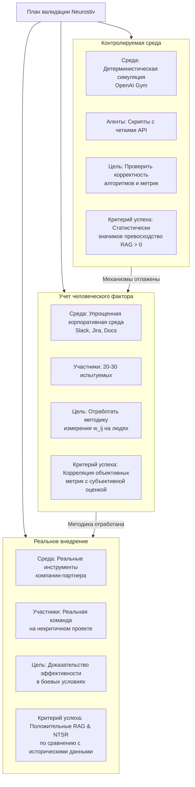

# Neurostiv Framework: Принципы мозга как инженерный протокол для адаптивных человеко-ИИ команд (v1.1)

[](docs/protocol-v1.1.en.md)

## Аннотация
**Проблема:** Существующие архитектуры человеко-машинного взаимодействия демонстрируют низкую адаптивность к неопределенности и новым задачам, что создает когнитивное "узкое горлышко" при интеграции ИИ в командную работу.

**Гипотеза:** Перенос принципов нейронной организации (избыточная связность и функциональная пластичность) на архитектуру Human-AI систем повысит их адаптивность и устойчивость к сбоям.

**Метод:** Разработана формальная математическая модель динамических связей между агентами и алгоритм активации сети. Предложен трехэтапный план валидации от синтетических экспериментов до промышленных пилотов.

**Ожидаемый результат:** Создание открытого, воспроизводимого протокола для проектирования адаптивных команд с измеримыми преимуществами (например, прирост скорости решения новых задач RAG > 0 и устойчивость к сбоям RM ≈ 1.0).

---

## Лицензия
Данный документ распространяется по лицензии [CC BY-NC-ND 4.0](https://creativecommons.org/licenses/by-nc-nd/4.0/).

Вы можете:
- Копировать и распространять материал в любых средствах массовой информации и форматах, при условии указания авторства.

Вы не можете:
- Модифицировать материал.
- Использовать материал в коммерческих целях.

---

Полные условия лицензии: https://creativecommons.org/licenses/by-nc-nd/4.0/

---

## Обращение к управленческим командам

Если вы руководитель команды разработки, продуктовый менеджер или технический директор, эта статья предлагает вам не просто новый инструмент, а **принципиально иной способ мышления об организации работы** в эпоху ИИ. 

Проблема знакома: внедрение ИИ-ассистентов часто не приносит ожидаемого прорыва в эффективности. Команды по-прежнему "застревают" на новых задачах, любое изменение требований вызывает каскад переделок, а коллективный интеллект людей и машин используется лишь частично.

Neurostiv Framework предлагает системное решение. **Это не ассистент в Slack — это архитектурный подход**, основанный на принципах работы самой адаптивной системы во Вселенной — человеческого мозга. Это не теория, а **готовый к проверке протокол** с четкими метриками и планом внедрения.

---

## Предисловие

Представьте, что ваша команда — это нейронная сеть. Сейчас большинство организаций работают как старые многослойные перцептроны: запрос спускается сверху вниз, проходя через жесткие, предопределенные связи. Один сбойный нейрон — ключевой разработчик в отпуске — и все рассыпается. Новая, непредвиденная задача вызывает панику, недели перепланирования и требует "перепрошивки" всей системы — бесконечных митингов и переделки ТЗ.

А теперь посмотрите на человеческий мозг. Он невероятно устойчив, пластичен и прекрасно справляется с новизной. В нем нет главного процессора, зато есть избыточность связей и способность нейронов быстро перераспределять задачи.

А что, если буквально перенести эти биологические принципы на уровень проектирования человеко-машинных систем? Наша гипотеза именно в этом.

Мы не просто добавим еще одного ИИ-ассистента в Slack. Мы радикально изменим архитектуру взаимодействия. Это не очередной стартап с громкими заявлениями. Это исследовательский фреймворк Neurostiv — открытый протокол для проверки гипотезы, и сегодня мы публикуем его первую итерацию (v1.1), чтобы начать диалог с сообществом.

---

## 1. Введение: Кризис когнитивной совместимости

Мы живем в эпоху когнитивного кризиса. Мощность ИИ растет по экспоненте, но наши инструменты для collaboration с ним остаются примитивными. Они стали узким горлышком бутылки, тормозящим всю систему.

**Основные проблемы:**
- **Неопределенность:** Стандартные интерфейсы ломаются, когда задача расплывчата или быстро меняется
- **Хрупкость:** Любое изменение требований приводит к дорогостоящему перепрограммированию и бесконечным митингам
- **Неэффективность:** Коллективный интеллект команды (людей и ИИ) используется на жалкие проценты

**Почему существующие решения не работают?**
- Когнитивные архитектуры (ACT-R, SOAR) слишком жестки и детерминированы для хаотичной реальности
- Нейроморфные вычисления копируют «железо» мозга, но игнорируют главное — проблему его интеграции с человеческим интеллектом
- Human-Centered AI часто фокусируется на точечном UX, а не на фундаментальной архитектуре взаимодействий в системе

**Наша гипотеза:** Проблема — не в инструментах, а на системном, архитектурном уровне. Решение — перенести в проектирование этих систем организационные принципы, которые сделали мозг самым адаптивным «устройством» во Вселенной: избыточность связей и функциональную пластичность.

Neurostiv — это не готовый продукт, а открытый протокол для проверки этой гипотезы. Это приглашение к совместной разработке и валидации.

---

## 2. Neurostiv Framework: Идеология и два ключевых принципа

Итак, мы предлагаем не просто новый инструмент, а новый способ мышления о проектировании систем. Фреймворк Neurostiv — это попытка создать язык для описания и экспериментов с архитектурой коллективного интеллекта. В его основе лежат два фундаментальных, проверяемых принципа, вдохновленных работой нейронных ансамблей.

### Принцип 1: Избыточная связность (Redundant Connectivity)

**Что это?** Это намеренное создание в системе большого количества «спящих» связей между ее элементами (людьми и ИИ-агентами) — связей с низким, но ненулевым весом. Это не «про запас», это активный резерв адаптивности.

**Аналогия из мозга:** В вашем мозгу синапсы не являются статичными. Одни укрепляются (долговременная потенциация), другие ослабевают (долговременная депрессия). Но даже «молчащие» синапсы могут быть быстро мобилизованы при обучении новому. Это и есть нейропластичность на микроуровне.

**Аналогия из IT:** Представьте, что у каждого разработчика из backend-команды есть слабая, но налаженная связь с дизайнером и аналитиком данных. Они не общаются каждый день (вес связи низкий), но когда возникает задача создать новый сложный дашборд, эта связь может быть мгновенно активирована, минуя бюрократические иерархии. Система не ломается, а перенастраивается.

**Ключевая идея:** Избыточность связей — это не хаос и не расточительство, а страховка от неопределенности и ускоритель для решения новых задач.

### Принцип 2: Функциональная пластичность (Functional Plasticity)

**Что это?** Это способность элементов системы (агентов) к быстрой функциональной переспециализации в зависимости от контекста решаемой задачи. Роли становятся текучими и определяются не должностной инструкцией, а потребностями момента.

**Аналогия из мозга:** При серьезных повреждениях (например, инсульт) мозг может «переназначить» целые участки коры на новые функции. Зоны, отвечавшие за одно, начинают брать на себя задачи поврежденных областей. Это пластичность на макроуровне.

**Аналогия из IT:** В кризисной ситуации (скажем, критический баг в продакшене) DevOps-инженер с опытом в разработке может временно «принять роль» код-ревьюера или даже написать хот-фикс, а ИИ-ассистент, обычно занимающийся документированием, может переключиться на мониторинг логов и поиск аномалий. Их «вектор компетенций» позволяет это сделать.

**Ключевая идея:** Функциональная пластичность превращает команду из набора узких специалистов в гетерогенный пул универсальных «солдат», способных гибко перераспределять роли.

### Как это работает вместе?

Один принцип не работает без другого. Избыточные связи — это инфраструктура, «дороги», по которым может пойти сигнал. Функциональная пластичность — это «правила дорожного движения» и «навыки водителей», которые позволяют эффективно использовать эти дороги для достижения цели.

---

## 3. Математическое ядро: Как мы это формализуем

Здесь мы переходим от красивых аналогий к строгой инженерной практике. Чтобы принципы можно было проверить, нам потребовалось создать формальную модель. Это «скелет» фреймворка, который обеспечивает его воспроизводимость и предмет для конструктивной критики.

### Базовые определения:

- **Агент** $a_i$ — это любой участник системы (человек или ИИ-модуль). Каждый агент описывается вектором компетенций $c_i \in \mathbb{R}^m$, где $m$ — количество учитываемых навыков (например, `Python=0.9`, `SQL=0.7`, `Дизайн=0.2`).

- **Сила связи** $w_{ij}(t)$ — динамическая величина, определяющая потенциальную эффективность взаимодействия между агентами $a_i$ и $a_j$ в момент времени $t$. Рассчитывается как композитная функция:

**$w_{ij}(t) = \alpha \cdot s_{ij} + \beta \cdot r_{ij}(t) + \gamma \cdot f_{ij}(t)$** (1)

Где:
- $s_{ij}$ — **Семантическая близость** (статична): Косинусное сходство векторов компетенций $c_i$ и $c_j$. Отвечает на вопрос: «Насколько потенциально полезным может быть их взаимодействие?»
- $r_{ij}(t)$ — **Историческая прочность** (медленно меняется): Нормализованная мера успешности прошлых совместных решений (например, количество закрытых задач в Jira)
- $f_{ij}(t)$ — **Актуальная частота** (быстро меняется): Экспоненциально взвешенное скользящее среднее событий взаимодействия (сообщения в Slack, упоминания)
- $\alpha, \beta, \gamma$ — Весовые коэффициенты, подбираемые эмпирически ($\alpha + \beta + \gamma = 1$)

### Алгоритм активации сети:

Функция `stimulate_network(input_task)` — это сердце модели. Ее работа формализована в виде итеративного процесса:

1. **Первичная активация:** Входящая задача $t$ (тоже вектор) сравнивается с векторами компетенций всех агентов. Выбираются наиболее релевантные агенты (где косинусная близость $c_i$ и $t$ превышает порог $\theta_{relevance}$).

2. **Решение в ядре:** Система пытается решить задачу, используя только сильные связи (где $w_{ij} > \theta_{strong}$), рассчитанные по формуле (1), между отобранными агентами.

3. **Расширение сети:** Если решение не найдено или его качество ниже порога $\theta_{success}$, алгоритм ищет слабые связи ($w_{ij} < \theta_{strong}$), ведущие к агентам, релевантным задаче. Эти связи активируются, и агенты включаются в рабочую группу.

4. **Критерий остановки:** Процесс завершается при успешном решении или исчерпании пула кандидатов для активации.

### Целевая функция системы

Алгоритм `stimulate_network` неявно оптимизирует следующую целевую функцию:

**$L(A, W, T) = \lambda_1 \cdot \text{NTSR}(A, W, T) - \lambda_2 \cdot \text{CoR}(W) - \lambda_3 \cdot \text{ResponseTime}(A, T)$** (2)

Где:
- **$A$** — множество активированных агентов
- **$W$** — матрица связей в момент времени $t$
- **$T$** — входящая задача
- **$\lambda_1, \lambda_2, \lambda_3$** — весовые коэффициенты важности метрик
- **NTSR** — New Task Success Rate (способность решать новые задачи)
- **CoR** — Cost of Redundancy (избыточные затраты на неиспользуемые связи)
- **ResponseTime** — Время отклика системы

**Интерпретация:** Система максимизирует способность решать новые задачи (NTSR), минимизируя избыточные затраты на неиспользуемые связи (CoR) и время отклика. Целевая функция (2) позволяет балансировать между этими критериями в зависимости от приоритетов организации.

**Ограничения:**
```
Σ w_{ij} ≤ W_max (бюджет связей)
|A| ≤ A_max (максимальный размер команды)
NTSR ≥ θ_min (минимальный порог успешности)
```

Данная формализация позволяет математикам и исследователям операций анализировать поведение системы методами выпуклой оптимизации и теории игр.
---

## 4. Как измерить успех? Система метрик

Гипотезы требуют проверки, а инженерные решения — объективной оценки. Чтобы доказать или опровергнуть преимущества Neurostiv-архитектуры, мы предлагаем систему взаимосвязанных метрик, которые оценивают не только результат, но и «цену успеха».

| Метрика | Формула / Определение | Что измеряет и зачем |
| :--- | :--- | :--- |
| **Relative Adaptation Gain (RAG)** | `RAG = (ART_control - ART_neurostiv) / ART_control` <br> *ART — Average Resolution Time* | **Относительное преимущество в скорости.** Показывает, насколько система Neurostiv быстрее справляется с новыми задачами по сравнению с контрольной группой (например, иерархией). RAG > 0 — преимущество есть. <br> **Пример:** Если иерархическая команда решала задачу за 10 дней, а Neurostiv-команда — за 7 дней, то `RAG = (10 - 7) / 10 = 0.3`. Это значит, мы получили **30%-е относительное преимущество** в скорости. |
| **Robustness Metric (RM)** | `RM = PAP / BP` <br> *PAP – Performance After Perturbation <br> BP – Base Performance* | **Устойчивость к сбоям.** Насколько система сохраняет эффективность после отказа ключевого агента или появления сильной «шумовой» задачи. RM ~ 1.0 — идеальная устойчивость. <br> **Пример:** Команда из 5 человек теряет ключевого разработчика (базовая производительность BP = 100%, после сбоя PAP = 60%). `RM = 60% / 100% = 0.6`. Neurostiv-команда, благодаря избыточности связей, перераспределяет нагрузку (PAP = 90%). `RM = 90% / 100% = 0.9`. |
| **Novel Task Success Rate (NTSR)** | `NTSR = (Кол-во решённых новых задач) / (Общее кол-во новых задач) × 100%` | **Способность к инновациям.** Ключевой показатель адаптивности. Ответ на вопрос: «Как часто система справляется с тем, для чего не была заранее предназначена?» <br> **Пример:** За месяц поступило 10 задач новых типов (например, интеграция с незнакомым API). Из них 8 были успешно решены. `NTSR = 8 / 10 * 100% = 80%`. |
| **Cost of Redundancy (CoR)** | `CoR = (Всего_связей - Использовано_связей) / Всего_связей` | **Цена избыточности.** Какую «налоговую нагрузку» неиспользуемые связи несут на систему. Оптимизация — поиск баланса между высоким RAG и низким CoR. <br> **Пример:** В системе зафиксировано 1000 потенциальных связей между участниками, но для решения всех задач текущего спринта было активировано только 650. `CoR = (1000 - 650) / 1000 = 0.35` (**35% "простоя" связей**). |

### Почему такая система?

Мы сознательно ушли от сырых абсолютных значений (секунды, проценты) к относительным и сравнительным метрикам. Это позволит нам:
- Корректно сравнивать результаты экспериментов в разных командах и условиях
- Иметь дело не с абстрактными числами, а с понятными отношениями («в 1.5 раза быстрее», «на 30% устойчивее»)
- Quantify the trade-off между адаптивностью и стоимостью ее поддержания

**Открытый вопрос для сообщества:** Какие еще метрики вы считаете ключевыми для оценки адаптивности?

---

## 5. План валидации: От синтетики к реальному миру

Любую архитектурную гипотезу необходимо проверять итеративно, минимизируя риски и стоимость экспериментов. Мы предлагаем трехуровневый путь валидации, который позволяет отточить механизмы на синтетических данных, прежде чем нести их в реальный мир.



### Комментарий к этапам:

**Этап 0: Синтетическая валидация.** Цель — доказать, что ядро алгоритма работает в принципе, в идеальных условиях.

**Этап 0.5: Лабораторный эксперимент.** Цель — убедиться, что наши метрики (сила связи $w_{ij}$, частота взаимодействий) корректно измеряются в среде, где люди используют реальные инструменты, но еще не решают реальные бизнес-задачи.

**Этап 1: Промышленный пилот.** Ключевой этап, где теория сталкивается с практикой. Здесь впервые включается полномасштабный фактор организационной среды: настоящая политика, бюрократия, устоявшиеся процессы и личные отношения. Успех на этом этапе зависит не только от технической эффективности фреймворка, но и от его способности интегрироваться в существующую социальную структуру организации.


### Этап 0: Синтетическая валидация

- **Цель:** Доказать, что базовые алгоритмы и метрики вообще работают в идеальных условиях. Ответить на вопрос: «Может ли такая архитектура в принципе показать преимущество?»
- **Среда:** Детерминистическая симуляция (например, на базе OpenAI Gym или Unity ML-Agents). Мы полностью контролируем все переменные
- **Агенты:** Детерминированные скрипты с четко описанными «навыками» и предсказуемым поведением
- **Задачи:** Генерация задач с заведомо известным оптимальным путем решения
- **Критерий успеха:** Статистически значимое превосходство (RAG > 0, NTSR > 0) над контрольными группами (иерархия, полносвязная сеть)

### Этап 0.5: Лабораторный эксперимент

- **Цель:** Отработать методику измерения силы связей wᵢⱼ на основе цифровых следов и проверить, как человеческий фактор влияет на работу системы
- **Среда:** Упрощенная, но реальная корпоративная среда (выделенные каналы в Slack/Discord, доска в Jira, Google Docs)
- **Участники:** 20-30 испытуемых (студенты, добровольцы), разбитые на команды
- **Задачи:** Серии стандартизированных кейсов (спланировать мероприятие, разработать простую стратегию, решить комплексную головоломку)
- **Критерий успеха:** Наличие корреляции между объективными метриками системы (RAG, NTSR) и субъективной оценкой эффективности от самих участников

### Этап 1: Промышленный пилот

- **Цель:** Final proof. Валидация фреймворка в реальных условиях на некритичных бизнес-процессах
- **Среда:** Настоящие инструменты компании-партнера (корпоративный Slack, Jira, GitHub, Teams)
- **Участники:** 1-2 реальные команды (5-10 человек), работающие над настоящим проектом
- **Задачи:** Реальные задачи из бэклога, часть из которых отбирается по критерию новизны
- **Критерий успеха:** Положительные RAG и NTSR по сравнению с историческими данными работы этой же команды или по сравнению с параллельной контрольной группой

Такой подход позволяет нам идти от простого к сложному, неся ответственность перед партнерами и участниками исследований.

---

## 6. Это не тотальная слежка: Этический протокол

Любой мониторинг взаимодействий между людьми вызывает абсолютно оправданные опасения. Без доверия и добровольного участия весь проект Neurostiv теряет смысл. Поэтому этика не является "сопутствующим вопросом" — это краеугольный камень всего фреймворка. Мы открыто публикуем его принципы.

### Принципы Ethical by Design протокола Neurostiv:

1. **Информированное согласие:** Полное и недвусмысленное информирование участников о том, какие именно данные собираются (метаданные сообщений, история задач, но не содержание приватных переписок), как они обрабатываются (алгоритмы агрегации) и в каких целях используются (исключительно для адаптации системы, а не оценки людей).

2. **Анонимизация и агрегация на этапе сбора:** Данные обезличиваются сразу после сбора (например, с помощью хеширования идентификаторов с использованием "соли") и агрегируются до уровней, не позволяющих выделить отдельного человека. Вместо «Виктор Савицкий написал Сергею Петрову» система оперирует понятиями agent_id_1 и agent_id_2.

3. **Запрет на использование для оценки персонала:** Это железное правило. Данные, собранные в рамках Neurostiv, не могут быть использованы для премирования, увольнения, составления рейтингов или любого другого кадрового менеджмента. Этот пункт должен быть закреплен в официальном регламенте компании-партнера.

4. **Право на забвение:** Любой участник может в любой момент покинуть эксперимент, и все его персональные данные должны быть безвозвратно удалены из всех баз.

5. **Аудит и прозрачность:** Участники имеют право знать, какие данные о них собраны и как рассчитаны их метрики. Мы выступаем за максимальную прозрачность алгоритмов, чтобы исключить слепое доверие к "черному ящику".

Наш подход — не минимизировать риски, а исключить их архитектурно. Мы проектируем систему не как инструмент наблюдения, а как средство создания психологически безопасной и по-настоящему адаптивной среды.

**«Neurostiv — это не инструмент контроля людей, а инструмент повышения адаптивности системы».**

---

## 7. Призыв к сотрудничеству

Neurostiv — это открытый протокол. Его истинность и ценность определяются не нашими заявлениями, а результатами независимой верификации и применения сообществом. Мы ищем не сторонних наблюдателей, а со-исследователей, со-архитекторов и партнеров, готовых вместе строить этот стандарт.

### Мы открыты для сотрудничества по нескольким направлениям:

**Для исследователей и ученых** (нейронауки, HCI, теория управления):
- Критика и развитие модели: Ваши правки, дополнения и альтернативные предложения к формальной модели и метрикам — бесценны. Готовы к совместным публикациям
- Разработка экспериментов: Помощь в протоколах этапов 0.5 и 1, особенно в части валидации на человеке
- Верификация аналогий: Помогите нам проверить, насколько биологические принципы корректно переносятся в архитектуру систем

**Для инженеров и разработчиков:**
- Разработка симулятора (Этап 0): Помощь в создании детерминистической симуляции на базе OpenAI Gym или аналогичных фреймворков
- Создание инструментария: Разработка прототипов плагинов для сбора анонимизированных данных из Jira, Slack, GitHub
- Оптимизация алгоритмов: Помощь в оптимизации алгоритмов расчета матриц связей для работы в реальном времени

**Для компаний и индустриальных партнеров:**
- Пилотные программы: Предложите свою площадку для проведения Этапа 0.5 (лабораторный эксперимент) или Этапа 1 (промышленный пилот) на некритичных бизнес-процессах и получите полный аналитический отчет с приоритетным доступом к результатам
- Экспертиза: Критика модели с точки зрения применимости в реальных бизнес-реалиях

### Как присоединиться к работе прямо сейчас?

- **Обсудить модель и задать вопросы:** Присоединяйтесь к обсуждению в нашем Telegram-чате
- **Изучить материалы:** Исходный код симулятора и спецификации протокола будут публиковаться в открытом доступе на GitHub
- **Написать напрямую:** Для конкретных предложений о сотрудничестве пишите на email или в Telegram

Наша общая цель — не просто доказать гипотезу, а создать работающий, этичный и открытый стандарт для проектирования человеко-машинных систем будущего. Систем, которые будут не просто эффективными, но и по-настоящему адаптивными.

Вместе мы сможем построить новую архитектуру коллективного интеллекта.

---

**P.S.** Мы делаем это потому, что верим: конечная цель — не улучшение ИИ, а улучшение условий сотрудничества между человеком и ИИ. Мы создаем почву для их синергии, а не конкуренции. И это, пожалуй, одна из самых важных задач на пути к будущему, в котором технология служит усилению человеческого потенциала, а не его подавлению.

---

## Заключение

Мы стоим на пороге фундаментального сдвига в проектировании систем коллективного интеллекта. Накопившийся «когнитивный кризис» между человеком и ИИ требует не точечных исправлений, а принципиально нового архитектурного подхода. Neurostiv Framework — это наша попытка предложить такой подход, основанный не на умозрительных теориях, а на проверяемых биологически-вдохновленных принципах.

Этот документ — не истина в последней инстанции, а приглашение к совместной работе. Мы открыто представили нашу гипотезу, формальную модель, план валидации и этический протокол именно для того, чтобы получить вашу критику, идеи и помощь. Истинная сила фреймворка проявится только тогда, когда он будет испытан, оспорен и улучшен сообществом.

Будущее адаптивных человеко-машинных систем создается сегодня. И мы приглашаем вас создать его вместе с нами.

---

## Литература и источники

1. **По теме слабых связей и сетевого анализа:**
   - Granovetter, M. S. (1973). The Strength of Weak Ties. American Journal of Sociology, 78(6), 1360–1380. (Краеугольный камень для принципа избыточности)

2. **По нейробиологическим основам:**
   - Anderson, M. L. (2010). Neural reuse: A fundamental organizational principle of the brain. Behavioral and Brain Sciences, 33(4), 245–266. (Прямое обоснование функциональной пластичности)
   - Sporns, O. (2011). Networks of the Brain. The MIT Press. (Классика по теории сетей мозга)

3. **По инженерной психологии и HCI:**
   - Norman, D. A. (2013). The Design of Everyday Things: Revised and Expanded Edition. Basic Books. (Обязательная ссылка для любого дизайнера систем)
   - Shneiderman, B. (2020). Human-Centered AI. Oxford University Press. (Современный взгляд, с которым мы спорим и который дополняем)

4. **По кибернетике и сложным системам:**
   - Meadows, D. H. (2008). Thinking in Systems: A Primer. Chelsea Green Publishing. (Для обоснования системного подхода)
   - Ashby, W. R. (1956). An Introduction to Cybernetics. Chapman & Hall. (Фундаментальная работа для обоснования адаптивности)

---

## Автор и контакты

**Виктор Савицкий** — инженерный психолог, исследователь архитектуры Human-AI систем, основатель проекта DHAIE (Design Human AI Engineering and Enhancement).

Мой background в инженерной психологии и нейро-лингвистическом программировании позволяет видеть проблему Human-AI интеграции не только как техническую, но и как когнитивную и коммуникативную задачу. Именно поэтому Neurostiv Framework фокусируется на архитектурных принципах взаимодействия, а не только на алгоритмической оптимизации.

**Контакты:**
- Сайт проекта: [designhumanai.com](http://designhumanai.com)
- Telegram-канал: [@dhaie_human_ai](https://t.me/dhaie_human_ai)
- GitHub: [github.com/designhumanai](https://github.com/designhumanai/)
- Email: viktor@designhumanai.com

**Репозиторий проекта:** Актуальные версии рабочих материалов и код симулятора размещаются в открытом репозитории: [github.com/designhumanai/neurostiv-framework](https://github.com/designhumanai/neurostiv-framework)

---

## Лицензия и авторские права

**Лицензия:** Материалы статьи и спецификации протокола Neurostiv Framework распространяются по лицензии [Creative Commons Attribution-NonCommercial-NoDerivatives 4.0 International (CC BY-NC-ND 4.0)](https://creativecommons.org/licenses/by-nc-nd/4.0/).

**Copyright:** © 2025 Виктор Савицкий, DHAIE Project. Все права защищены, если не указано иное.

**Версия документа:** Neurostiv Framework v1.1  
**Дата публикации:** 15 сентября 2025 года  
**Последнее обновление:** 15 сентября 2025 года

---

*Статья опубликована в рамках проекта DHAIE (Design Human AI Engineering and Enhancement) — открытой исследовательской инициативы по развитию этичных и адаптивных человеко-машинных систем.*
